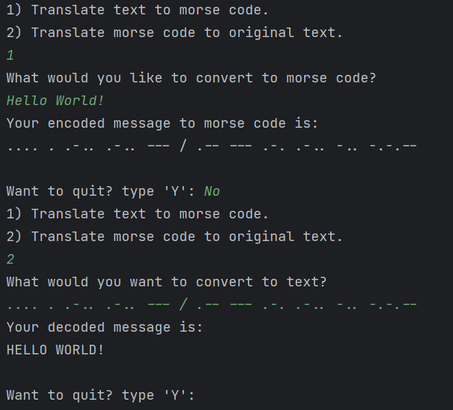
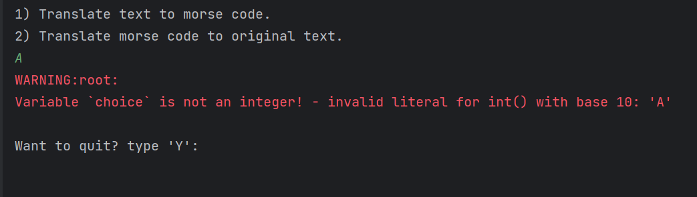

# text-to-morsecode
A basic command-line script to translate text to Morse code and vice versa.
## How to run
* Clone this repository to your local machine: `git clone https://github.com/mahmouddello/text-to-morsecode`.
* Navigate to the project directory: `cd ./text-to-morsecode`
* Run the tool using Python: `python main.py`
## Screenshots
### Success

### Failure
